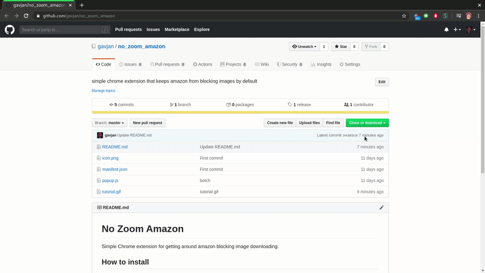

# No Zoom Amazon

Simple Chrome extension for getting around amazon blocking image downloading.

## How to install

1. Download the zip
2. Unzip it to a folder
3. In Chrome go to `⋮` -> `More Tools` -> `Extensions`
4. In the upper-right corner enable `Developer mode` toggle
5. Click `Load Unpacked`
6. Select your unzipped folder
7. Extension should now be active
